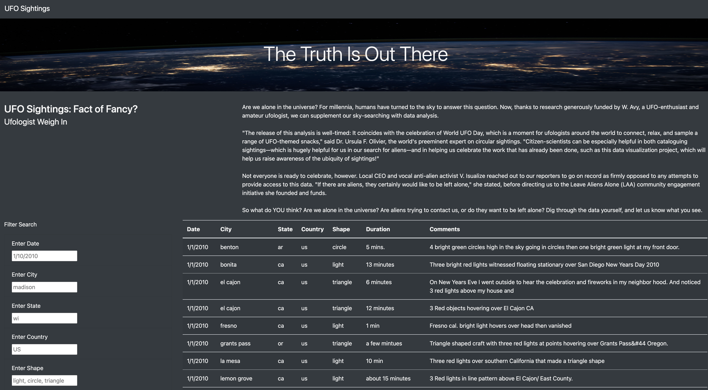
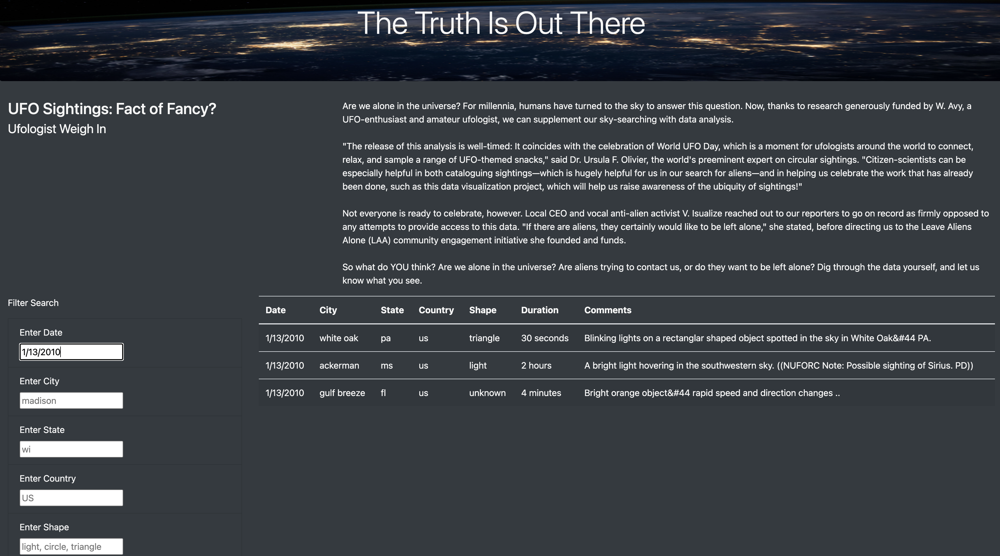
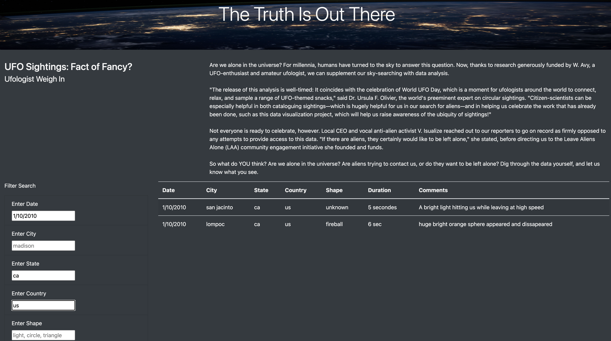
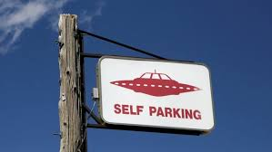

# UFOs

___
******
***Created a website that displays UFO-sightings data and is able to filter through it on user input using JavaScript, HTML/CSS, and Bootstrap***

## **Overview**

___
The purpose of this project is to create a clean webpage that contains a dynamic table of UFO sighting data. We've designed this table using Javascript as the primary coding language. Via the webpage, the end user can filter the data by various criteria and instantly see the results. We want to use filters since we have many different sightings that occurred throughout the U.S.-- based on the different areas or what type of shape of the sighting.

## **Resources**

___

+ DataSet:
  + [data.js](./static/js/data.js)
  
+ Software:
  + JavaScript
  + D3 Library
  + HTML
  + CSS
  + Bootstrap

## **Results**

___
The final result was the working website that allowed for five different categories to filter the data: date, city, state, country, and shape of the UFO.


### *Description*

___
+ [x] The website displays the data in the form of a well structured table with UFO's sighting date, city, state, country, shape, duration, and additional comments.
+ [x] The website was designed using JavaScript and HTML. It has been well arranged and decorated using CSS and Bootstrap.
+ [x] To navigate through its functionality, the user would need to click on the input boxes provided to the left and enter a valid text-option for the category to be filtered. If you enter a incorrect fitler or a variable that does not exist in the data, you will get an empty table. In this case, try again.
+ [x] To come back to the original dataset (without filters included) click on the top left where it says UFO Sightings and the HTML will get redirected.

  *Mono-filter example:*
  

*Multi-filter example:*


*To see the website you can click here -* [Active GitHub HTML Page](https://github.com/DangCoop/UFOs/blob/main/index.html)

## **Summary**

___
We have created a page that looks clean and allows the user to filter through the different sitings in our data set using the search bars created. First drawback is that Javascript language is case sensitive. This is can impact the user experience because all of the searchable data is lowercase. For example, if a user were to enter "CA" to identify the UFO sightings in California, the filter search results are zero. Whereas, if they were to enter "ca" in lower case, there are plenty of results. Second drawback is the absence of a larger database that is not limited to one country, and even a continent, but the matter is small - you just need to start. And a start has been made!!!
I also want to make my own adjustments to improve the project. I would like to add not only data in the js format, but also create a multimedia library with photos and even small video clips that is as good as possible. As an option to promote the site, you can create an online chat to discuss new cases of UFO sightings with the involvement of some well-known Ufologist to raise the rating of the project. Then you can connect a historical archive with data on the presence of alien races on Earth and their impact on the development of mankind ....

*"There are aliens out there, somewhere. I strongly belive this"*



```
Denis Antonov August 24, 2022
```
